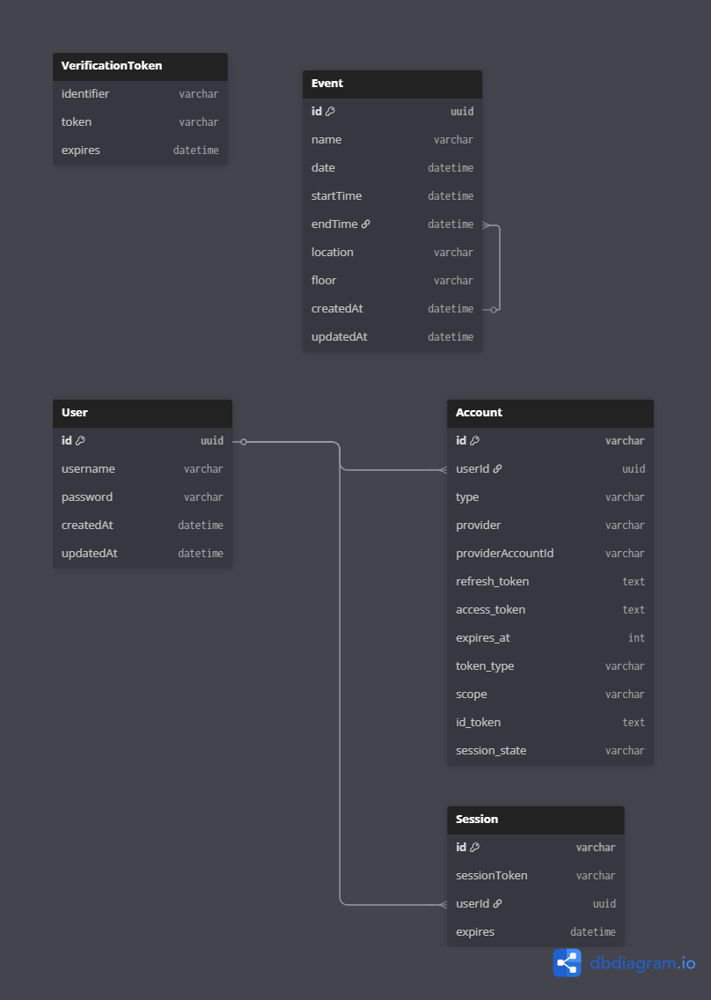

# Servo App

A Next.js application for managing and displaying event schedules with an admin dashboard for event management.

## Features

- **Public Display**: Shows today's events on the main page with an image carousel
- **Event Management**: Admin dashboard for creating, updating, and deleting events
- **Authentication**: Secure admin login system
- **Event Listing**: View all events in a paginated table
- **Responsive Design**: Modern UI with Tailwind CSS

## Navigation

### Public Pages
- **Home (`/`)**: Main display showing today's events with image carousel
- **Events (`/events`)**: Public view of all events in a table format

### Admin Pages
- **Admin Login (`/admin/login`)**: Authentication page for administrators
- **Admin Dashboard (`/admin/dashboard`)**: Protected admin panel for event management
  - Create new events
  - Update existing events
  - Delete events
  - View all events in a table

### API Routes
- **`/api/auth/[...nextauth]`**: NextAuth.js authentication endpoints
- **`/api/events`**: Event CRUD operations
- **`/api/events/[id]`**: Individual event operations

## Getting Started

First, run the development server:

```bash
npm run dev
# or
yarn dev
# or
pnpm dev
# or
bun dev
```

Open [http://localhost:3000](http://localhost:3000) with your browser to see the result.

You can start editing the page by modifying `app/page.tsx`. The page auto-updates as you edit the file.

## Environment Variables

Create a `.env.local` file in the root directory with the following variables:

```env
# Database
DATABASE_URL="your-database-url"

# NextAuth
NEXTAUTH_SECRET="your-nextauth-secret"
NEXTAUTH_URL="http://localhost:3000"

# Optional: Base URL for API calls
NEXT_PUBLIC_BASE_URL="http://localhost:3000"
```

## Database Setup

This project uses Prisma as the ORM. To set up the database:

```bash
# Install dependencies
npm install

# Generate Prisma client
npx prisma generate

# Run database migrations
npx prisma migrate dev

# (Optional) Seed the database
npx prisma db seed
```

## Build and Deploy

```bash
# Build for production
npm run build

# Start production server
npm start
```

## Project Structure

```
servo-app/
├── app/
│   ├── admin/           # Admin pages
│   │   ├── dashboard/   # Admin dashboard
│   │   └── login/       # Admin login
│   ├── api/             # API routes
│   ├── components/      # Reusable components
│   ├── events/          # Public events page
│   └── page.tsx         # Home page
├── lib/                 # Utility functions and services
├── prisma/              # Database schema and migrations
└── public/              # Static assets
```

## Technologies Used

- **Next.js 15**: React framework with App Router
- **TypeScript**: Type-safe JavaScript
- **Tailwind CSS**: Utility-first CSS framework
- **Prisma**: Database ORM
- **NextAuth.js**: Authentication
- **PostgreSQL**: Database (via Prisma)

## Database Schema

The application uses a PostgreSQL database with the following structure:



### Key Tables
- **User**: Admin user accounts for authentication
- **Event**: Event data with name, date, time, and location
- **Account**: NextAuth.js account management
- **Session**: NextAuth.js session management
- **VerificationToken**: NextAuth.js email verification
